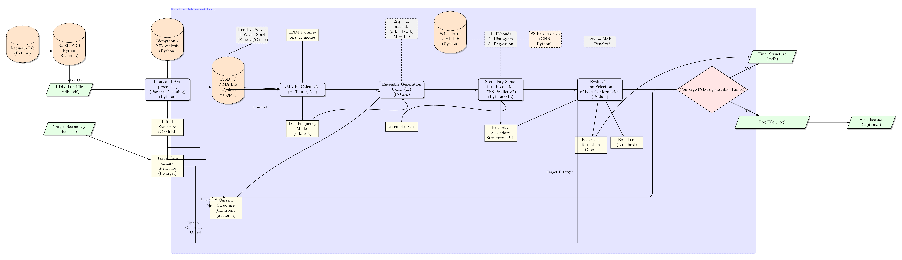

# ReFolder

ReFolder is a computational tool for protein structure refinement using normal mode analysis in internal coordinates (NMA-IC), ensemble generation, secondary structure prediction, and iterative evaluation.

## Workflow

The workflow diagram below outlines the key steps in the ReFolder pipeline:



## Overview

**ReFolder** is a computational tool under development for analyzing protein conformational transitions using Internal Coordinate Normal Mode Analysis (iNMA). The project is based on the methodology described in the article *"Internal Coordinate Normal Mode Analysis: A Strategy To Predict Protein Conformational Transitions"* by Frezza & Lavery (2019). The goal is to predict transitions between unbound and bound states of proteins by calculating normal modes in internal coordinates (dihedral angles φ and ψ) and evaluating their overlap with the actual conformational change.

This project is currently in the **development stage**. Several components (e.g., reconstruction of Cartesian coordinates from internal coordinates, analytical derivatives, and additional metrics) are implemented as placeholders and require further implementation.

## Features (Planned)

- **Protein Model**: Implements a simplified Zacharias model with main chain atoms (N, Cα, C', O) and pseudo-atoms for side chains (SC1, SC2). Currently simplified to Cα-only for testing.
- **Internal Coordinates**: Uses dihedral angles φ and ψ as internal coordinates.
- **Potential Energy**: Anisotropic Elastic Network Model (ANM) with a sigmoid distance-dependent force constant and torsional rigidity to prevent overly soft modes.
- **Normal Mode Analysis**: Calculates Hessian (H) and kinetic (T) matrices in internal coordinates and solves the generalized eigenvalue problem using LAPACK.
- **Conformational Transitions**: Modifies protein structures along normal modes and evaluates the overlap and RMSD between modified and target (bound) structures.
- **Metrics**: Calculates overlap, RMSD_m-b, and plans to include RMSD_Ca-Ca and clash parameters.

## Project Structure

- **src/**: Source code files written in Fortran.
  - `types.f90`: Defines data types for protein structures.
  - `io.f90`: Handles input/output operations (reading/writing PDB files).
  - `internal_coordinates.f90`: Manages internal coordinates (φ, ψ) and their conversion to Cartesian coordinates (placeholder).
  - `potential.f90`: Computes the potential energy using an ANM model.
  - `matrices.f90`: Calculates Hessian and kinetic matrices (numerical derivatives).
  - `eigenproblem.f90`: Solves the generalized eigenvalue problem using LAPACK.
  - `modify_structure.f90`: Modifies the structure along normal modes.
  - `metrics.f90`: Computes evaluation metrics (overlap, RMSD).
  - `main.f90`: Main program orchestrating the analysis.
- **tests/**: Test data.
  - `unbound.pdb`: Example PDB file for the unbound state.
  - `bound.pdb`: Example PDB file for the bound state.

## Installation and Usage

### Prerequisites
- A Fortran compiler (e.g., `gfortran`).
- LAPACK and BLAS libraries for solving eigenvalue problems (`-llapack -lblas`).

### Compilation
1. Navigate to the project directory:
   ```bash
   cd ReFolder
   ```
2. Compile the program:
   ```bash
   gfortran -o refolder src/*.f90 -llapack -lblas
   ```

### Running the Program
1. Ensure the test PDB files are in the `tests/` directory.
2. Run the program:
   ```bash
   ./refolder
   ```
   The program expects `unbound.pdb` and `bound.pdb` in the working directory (you may need to copy them from `tests/`).

### Expected Output
The program will output for each normal mode:
```
Mode: <number> Min RMSD_m-b: <value> Optimal Beta: <value> Overlap: <value>
```

## Current Limitations
- **Cartesian Coordinate Reconstruction**: The conversion from internal coordinates (φ, ψ) to Cartesian coordinates is a placeholder. A proper algorithm (e.g., NERF) is needed.
- **Numerical Derivatives**: Hessian and kinetic matrices are computed using numerical differentiation, which is slow. Analytical derivatives should be implemented.
- **Metrics**: Only overlap and RMSD_m-b are implemented. RMSD_Ca-Ca and clash parameters are planned.
- **Two-Mode Combinations**: Currently analyzes one mode at a time. Support for combining two modes with phase variation is planned.
- **Structure Alignment**: Overlap calculation assumes structures are pre-aligned. An alignment algorithm (e.g., Kabsch) is needed.

## Contributing
Contributions are welcome! If you'd like to contribute, please:
1. Fork the repository.
2. Create a new branch for your feature or bugfix.
3. Submit a pull request with a detailed description of your changes.

## License
This project is licensed under the MIT License (to be added).

## Contact
For questions or suggestions, please open an issue on GitHub.